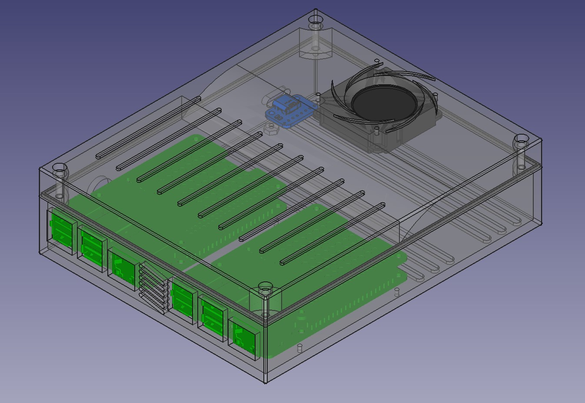

# dual-pi-server
Dual Raspberry Pi servers project. Enclosure, hardware and Pi servers 

## Features
- Fit 2 Raspberry Pi 4 boards tiled in the enclosure
- Main Pi for hosting DNS, logging environmental variables
- Aux Pi for deploying other services
- Customized enclosure

